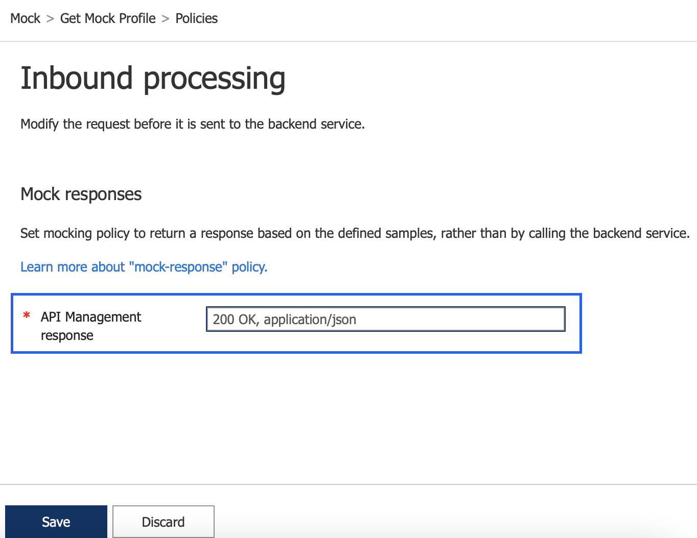

# Getting Start with Azure API Management (APIM)

## First Mock API

This exercise we will try to add mock API to APIM. Mock API response is very useful to shorten the development process. Especially when have multiple developemnt team, e.g. Frontend devloper and Backend developer. Instead of making Frontend developer to wait until Backend developer complete develop backend API, we can remove this dependency by adding API mock response so that both development team can start working simultanousely 

1. Login to Azure Portal and navigate to Azure API Management
2. Menu `APIs`, then click `+Add API`, then select `HTTP`

3. Enter information for `Mock` api

4. Then `Add operation`, and fill in the information as an example below

5. On the `Response`, Click `+ Add response` and select `200 OK`, then click `+ Add representation`

6. Fill in information
- Content Type: application/json
- Sample: <Your mock response>

7. Then click `Save`

8. Click `+ Add Policy` 

9. On `Add inbound policy` select `Mock responses`

10. On `Inbound processing` Select `200 OK, application/json`, then Click save

11. Test API to see if it returns the mock data or not.

## Create set of API by using swagger
1. In this repository, we have provided `swagger.yaml` which is defined to matched the backend microservice which is running inside kubernetes.
2. In `Azure API Management`, menu `APIs`, click `+ Add API` and select `OpenAPI`
3. Update the `swagger.yaml` and then put `profile` as an `API URL suffix`
4. Then click `Create`
